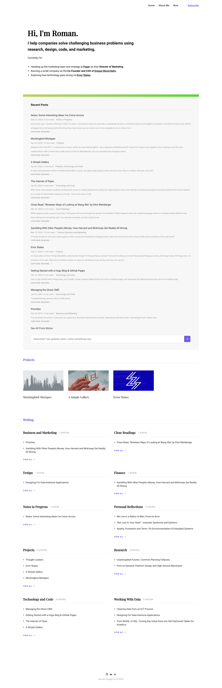

# easey-ghost-theme
Source code for a Ghost theme I've adapted for personal purposes. Slowly, it is drifting away from the original Ease.

## Currently on 
Version `2.1.6` 

# Notes on Using the Theme

## Adding Homepage Content
Create a `page` and tag it with `about`. This page will get published as the homepage content. 

## Demo Site

Originally used on https://romandesign.co but I've since switched to a new theme. 

